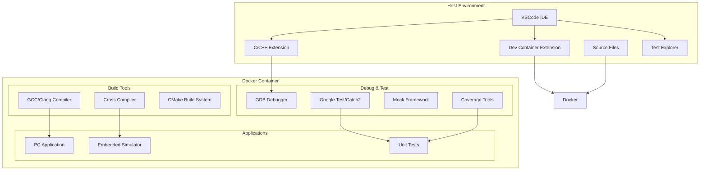

# Design Document

## Overview

VSCode Dev Containers機能とC/C++拡張機能を活用して、Dockerコンテナ内でのC/C++開発とグラフィカルデバッグを実現するシステムです。一般的なC/C++開発に加えて、組み込み開発に特化した機能を提供し、PC上でデバッグ可能な部分の開発・テストを効率化します。Autosar開発も組み込み開発の一例として対応します。開発者はローカル環境と同様の操作感でコーディング、ビルド、デバッグ、テストを行えます。

## Architecture

### システム構成



### 主要コンポーネント

1. **Dev Container Configuration**: `.devcontainer/devcontainer.json`でコンテナ環境を定義
2. **VSCode Tasks**: ビルド・テストタスクの自動化
3. **Launch Configuration**: デバッグ設定の管理
4. **Docker Environment**: C/C++開発環境を含むコンテナ
5. **Embedded Development Tools**: 組み込み開発用クロスコンパイラとツールチェーン
6. **Test Framework Integration**: 単体テスト・統合テストの実行環境

## Components and Interfaces

### 1. Dev Container Configuration

**責任**: Dockerコンテナの設定と初期化

**インターフェース**:
- `devcontainer.json`: コンテナ設定ファイル
- `Dockerfile`: カスタムイメージ定義
- `docker-compose.yml`: 複数サービス構成（オプション）

**主要機能**:
- C/C++開発ツールチェーンのインストール
- VSCode拡張機能の自動インストール
- ポートフォワーディング設定
- ボリュームマウント設定

### 2. Build System Integration

**責任**: ソースコードのコンパイルとビルド管理

**インターフェース**:
- `tasks.json`: VSCodeタスク定義
- `CMakeLists.txt`: CMakeビルド設定
- `Makefile`: Make ビルド設定（代替）

**主要機能**:
- 自動ビルドタスクの実行
- エラー出力の解析と表示
- インクリメンタルビルドの最適化

### 3. Debug Configuration

**責任**: デバッグセッションの管理と制御

**インターフェース**:
- `launch.json`: デバッグ起動設定
- GDB/LLDB デバッガプロトコル
- VSCode Debug Adapter Protocol

**主要機能**:
- ブレークポイント管理
- 変数監視とスタック表示
- ステップ実行制御

### 4. File Synchronization

**責任**: ホストとコンテナ間のファイル同期

**インターフェース**:
- Docker bind mounts
- VSCode file watcher
- Container file system

**主要機能**:
- リアルタイムファイル同期
- 権限管理の自動調整
- パフォーマンス最適化

## Data Models

### Project Configuration

```typescript
interface ProjectConfig {
  name: string;
  type: 'desktop' | 'embedded' | 'autosar';
  compiler: 'gcc' | 'clang' | 'msvc' | 'arm-gcc' | 'riscv-gcc';
  standard: 'c++11' | 'c++14' | 'c++17' | 'c++20' | 'c++23';
  buildSystem: 'cmake' | 'make' | 'ninja' | 'autosar-build';
  debugger: 'gdb' | 'lldb' | 'arm-gdb';
  testFramework: 'gtest' | 'catch2' | 'unity';
  target: {
    architecture: 'x86_64' | 'arm' | 'riscv' | 'simulation';
    platform: string;
  };
  dependencies: string[];
  autosarConfig?: {
    platform: 'classic' | 'adaptive';
    version: string;
    modules: string[];
  };
}
```

### Container Configuration

```typescript
interface ContainerConfig {
  baseImage: string;
  workspaceFolder: string;
  extensions: string[];
  forwardPorts: number[];
  postCreateCommand: string;
  remoteUser: string;
}
```

### Debug Configuration

```typescript
interface DebugConfig {
  name: string;
  type: 'cppdbg';
  request: 'launch' | 'attach';
  program: string;
  args: string[];
  cwd: string;
  environment: Record<string, string>;
  setupCommands: DebugCommand[];
}
```

## Error Handling

### ビルドエラー処理

1. **コンパイルエラー**: 
   - GCC/Clangエラー出力の解析
   - VSCode Problems パネルでの表示
   - ソースコード内でのエラーハイライト

2. **リンクエラー**:
   - 依存関係の不足検出
   - 推奨解決策の提示
   - 自動修正オプションの提供

### デバッグエラー処理

1. **デバッガ接続失敗**:
   - GDBプロセスの状態確認
   - ポート競合の検出と解決
   - 代替デバッガの提案

2. **シンボル情報不足**:
   - デバッグシンボルの有無確認
   - コンパイルオプションの自動調整
   - 警告メッセージの表示

### コンテナエラー処理

1. **Docker接続エラー**:
   - Docker Desktopの起動状態確認
   - 権限問題の検出と解決手順提示
   - 代替設定の提案

2. **ファイル同期エラー**:
   - ボリュームマウントの確認
   - ファイル権限の自動修正
   - 同期状態の監視とレポート

## Testing Strategy

### 単体テスト

1. **設定ファイル生成**:
   - 各種テンプレートの正確性検証
   - JSON/YAML構文の妥当性確認
   - クロスプラットフォーム対応の検証

2. **ビルドシステム**:
   - 各コンパイラでのビルド成功確認
   - エラー処理の動作検証
   - パフォーマンス測定

### 統合テスト

1. **エンドツーエンドワークフロー**:
   - プロジェクト作成からデバッグまでの全工程
   - 複数OS環境での動作確認
   - 異なるプロジェクト構成での検証

2. **デバッグ機能**:
   - ブレークポイント設定と停止
   - 変数監視の正確性
   - ステップ実行の応答性

### パフォーマンステスト

1. **起動時間測定**:
   - コンテナ起動時間
   - デバッガ接続時間
   - 初回ビルド時間

2. **応答性測定**:
   - ファイル変更からビルド完了まで
   - デバッグ操作の応答時間
   - 大規模プロジェクトでの性能

### 互換性テスト

1. **プラットフォーム対応**:
   - Windows (Docker Desktop)
   - Linux (Docker Engine)
   - macOS (Docker Desktop)

2. **VSCodeバージョン対応**:
   - 最新安定版での動作確認
   - 拡張機能の依存関係検証
   - VibeCoding環境での動作確認
## Deplo
yment and Maintenance

### サービス提供者の観点

#### デプロイメント戦略

1. **VSCode拡張機能による完全自動化**:
   - 拡張機能インストール後、ワンクリックでプロジェクト作成
   - 必要な設定ファイルの自動生成と配置
   - Dockerイメージの自動ダウンロードと起動

2. **ゼロコンフィグレーション**:
   - ネットワーク接続があれば手動設定不要
   - 依存関係の自動解決とインストール
   - OS固有の設定を自動検出・適用

3. **Dockerイメージ管理**:
   - 事前ビルド済みベースイメージの自動取得
   - バックグラウンドでの自動アップデート
   - キャッシュ機能による高速起動

#### メンテナンス要件

1. **イメージ更新管理**:
   - C/C++コンパイラの最新版対応
   - セキュリティパッチの適用
   - 依存関係の脆弱性監視

2. **互換性維持**:
   - VSCode拡張機能のバージョン追従
   - Docker APIの変更対応
   - 各OS環境での動作検証

3. **サポート体制**:
   - 拡張機能内蔵のトラブルシューティング機能
   - 自動診断とエラー修復機能
   - 最小限のドキュメント（基本的に不要）

#### 運用コスト最小化

1. **自動化**:
   - CI/CDパイプラインでのイメージビルド
   - 自動テストによる品質保証
   - 脆弱性スキャンの自動実行

2. **標準化**:
   - 設定ファイルテンプレートの標準化
   - エラーメッセージの統一
   - ログ形式の標準化

3. **コミュニティ活用**:
   - オープンソースとしての公開
   - コントリビューションガイドラインの整備
   - ユーザーコミュニティの育成#### 完全自動
化の実装

1. **拡張機能の自動セットアップ**:
   - 初回起動時の環境検出と自動設定
   - 必要な依存関係の自動インストール確認
   - エラー発生時の自動修復機能

2. **インテリジェントな設定管理**:
   - プロジェクト構造の自動解析
   - 最適なコンパイラ・ビルドシステムの自動選択
   - 設定ファイルの動的生成

3. **バックグラウンド処理**:
   - Dockerイメージの事前ダウンロード
   - 依存関係の先読みインストール
   - 設定変更の自動反映### 5. Emb
edded Development Support

**責任**: 組み込み・Autosar開発環境の提供

**インターフェース**:
- Cross-compilation toolchain
- Autosar development tools
- Hardware abstraction layer (HAL) simulators
- MISRA C/C++ compliance tools

**主要機能**:
- ARM/RISC-V等のクロスコンパイル
- Autosar Classic/Adaptive Platform対応
- PC上でのハードウェア抽象化シミュレーション
- 組み込み固有のデバッグ機能

### 6. Test Framework Integration

**責任**: 自動テストの実行と結果表示

**インターフェース**:
- Google Test/Catch2 integration
- VSCode Test Explorer
- Coverage reporting tools
- Mock framework integration

**主要機能**:
- 単体テストの自動実行
- テストカバレッジの測定・表示
- モックオブジェクトによるハードウェア依存部分のテスト
- CI/CD連携のためのテスト結果出力###
 Test Configuration

```typescript
interface TestConfig {
  framework: 'gtest' | 'catch2' | 'unity';
  coverage: {
    enabled: boolean;
    threshold: number;
    excludePatterns: string[];
  };
  mockFramework: 'gmock' | 'fff' | 'cmock';
  embeddedSimulation: {
    enabled: boolean;
    halMockLevel: 'full' | 'partial' | 'none';
    peripheralMocks: string[];
  };
  ciIntegration: {
    outputFormat: 'junit' | 'tap' | 'json';
    artifactPaths: string[];
  };
}
```

### Embedded Configuration

```typescript
interface EmbeddedConfig {
  crossCompiler: {
    toolchain: string;
    sysroot: string;
    flags: string[];
  };
  simulator: {
    type: 'qemu' | 'renode' | 'custom';
    config: string;
  };
  debugging: {
    gdbServer: string;
    openocdConfig?: string;
    jlinkConfig?: string;
  };
}
```